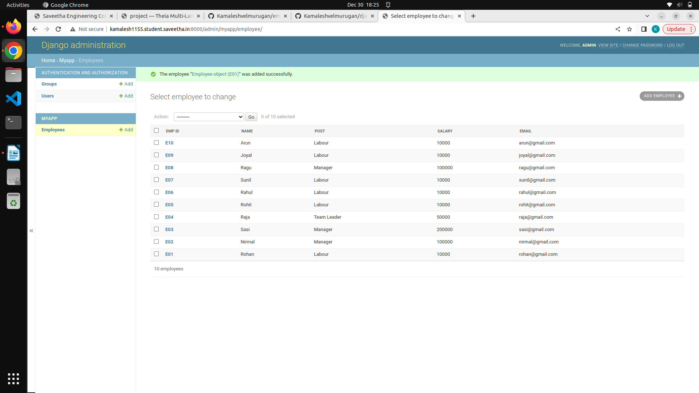
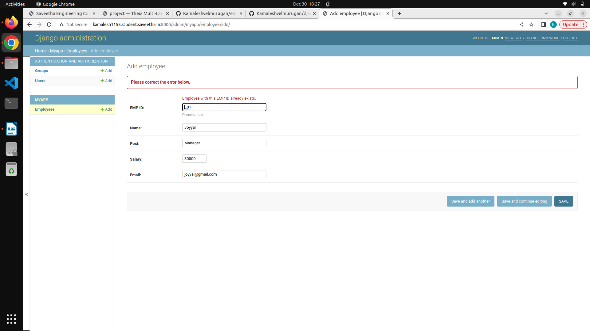

# Django ORM Web Application

## AIM
To develop a Django application to store and retrieve data from a database using Object Relational Mapping(ORM).

## Entity Relationship Diagram

Include your ER diagram here

## DESIGN STEPS

### STEP 1:

Git clone django-orm-project

### STEP 2:

Start myapp and create models and admin

### STEP 3:

Create superuser as admin 

### STEP 4:

Migration of myapp to the server

### STEP 5:

Testing the admin page 

## PROGRAM:

### Models Employee Program:

```
from django.db import models
from django.contrib import admin
# Create your models here

class Employee (models.Model):
    EMP_ID=models.CharField(primary_key=True,max_length=3,help_text="Phonenumber")
    Name=models.CharField(max_length=100)
    Post=models.CharField(max_length=30)
    Salary=models.IntegerField()
    Email=models.EmailField()

class EmployeeAdmin(admin.ModelAdmin):
    list_display=('EMP_ID','Name','Post','Salary','Email')
```

### Admin Site Program:

```
from django.contrib import admin
from .models import Employee,EmployeeAdmin
# Register your models here.
admin.site.register(Employee,EmployeeAdmin)
```

## OUTPUT

### Employee Id Details:



### Primary Key Error:



## RESULT:

A Django application to store and retrieve data from a database using Object Relational Mapping(ORM) is Developed.
